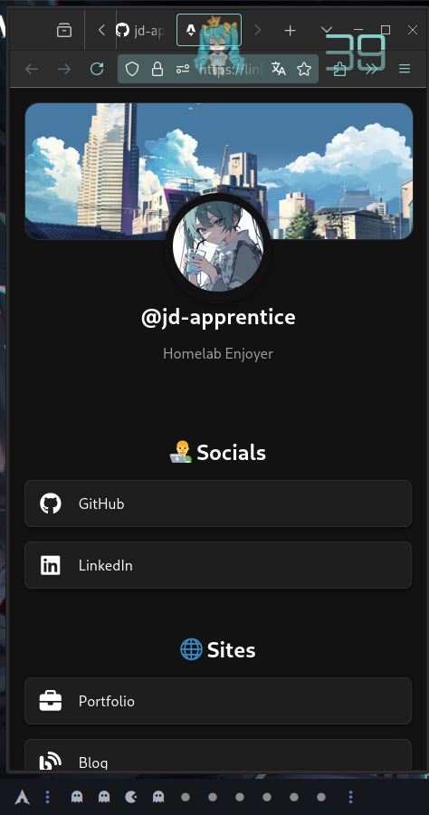

# jd-links 👨‍💻

Little shortcut to my links. 

## Desktop

## Mobile

### Stack

- [Astro](https://astro.build/)
- [Playwright](https://playwright.dev/)
- [TypeScript](https://www.typescriptlang.org/)
- [ESLint](https://eslint.org/)
- [Prettier](https://prettier.io/)
- [Husky](https://github.com/typicode/husky)

### License

[MIT](./LICENSE)